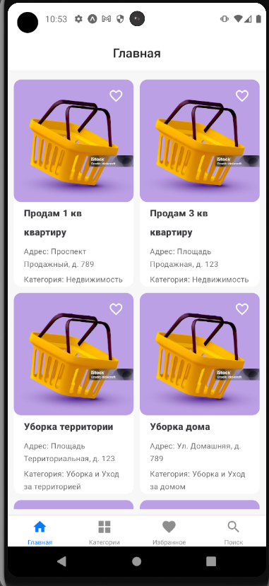
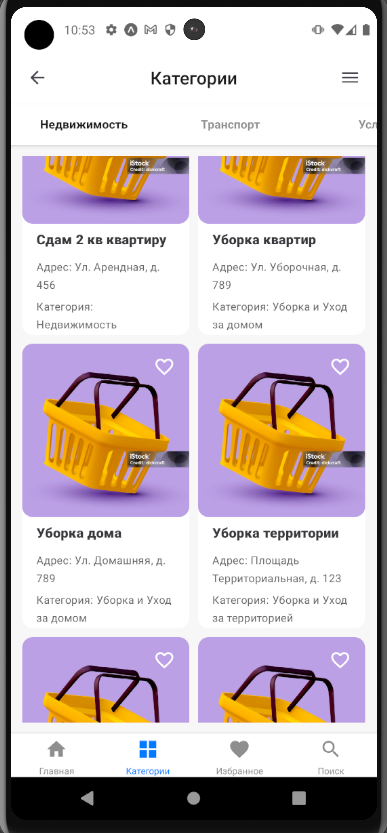
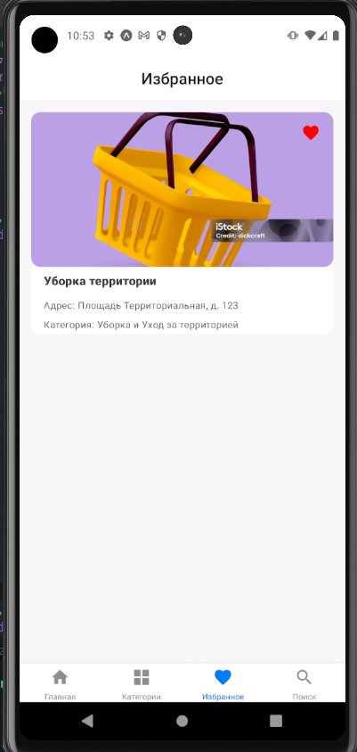
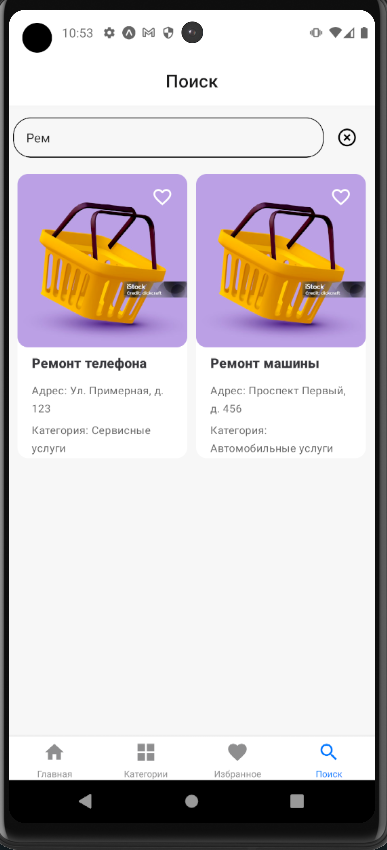

# React Native (React Navigation)

В данном проекте реализовано простое мобильное приложение, основной функциональностью которого является навигация с помощью React Navigation. В проекте использованы различные виды навигации из библиотеки: Stack, Top Tabs, Tabs, Drawer. Для удобства использования были созданы локальные карточки товаров и услуг.

Также была реализована страница "Избранное", где использовался Redux Toolkit и страница "Поиск" по карточкам.

Примеры работ: 

  
 Главное меню

  

   

  
 Категории 

  

  
 Избранное

  

   

  
 Поиск 

  

